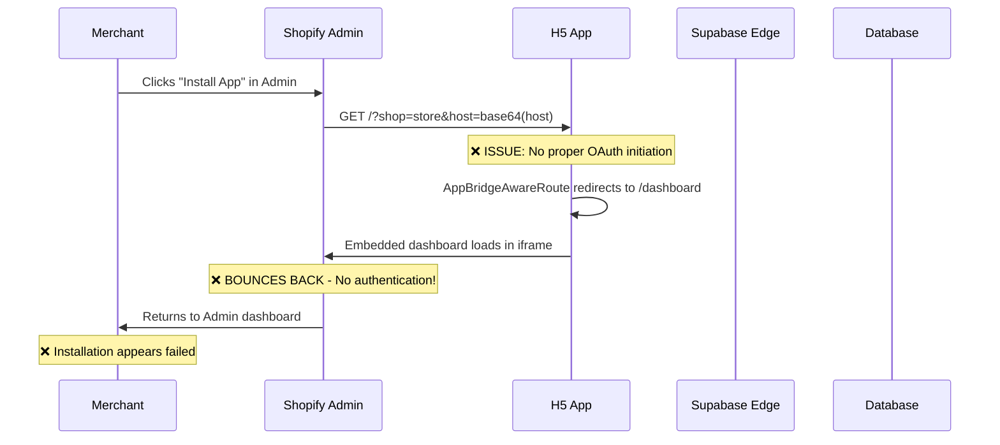
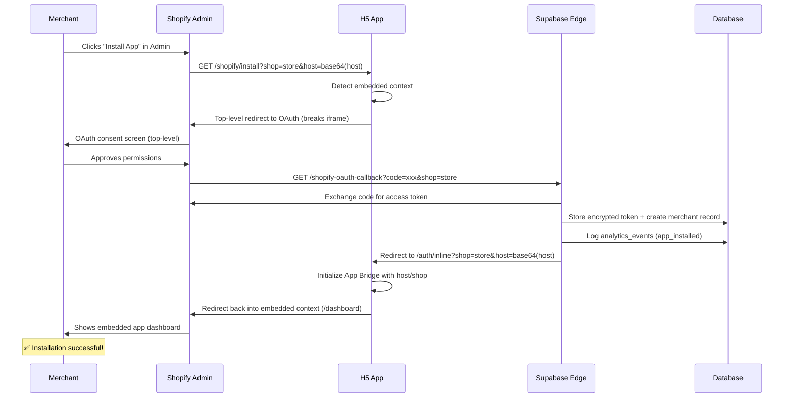

# H5 Shopify Embedded App - Installation Flow Analysis & Root Cause Report

## Executive Summary

This report provides a comprehensive analysis of the current H5 Shopify embedded app installation flow, identifies root causes for "Install from Shopify Admin bounces back to Admin dashboard" issues, and provides production-ready fixes.

## Current App Architecture

### Key Components & Libraries
- **Framework**: React 18.3.1 + TypeScript 5.5.3 + Vite 5.4.1
- **Shopify Integration**: @shopify/app-bridge@3.7.10 (Embedded App Bridge v3)
- **Backend**: Supabase Edge Functions (Deno runtime)
- **Database**: PostgreSQL with RLS (Row Level Security)
- **Authentication**: Hybrid (Supabase Auth + Shopify OAuth)

### File Structure Analysis

```
I:\CYBERPUNK\RAS-5\
├── shopify.app.toml                    # ✅ Shopify app configuration
├── .env.local                          # ✅ Environment variables
├── index.html                          # ⚠️  Missing CSP headers
│
├── src/
│   ├── components/
│   │   ├── AppBridgeProvider.tsx       # ✅ App Bridge setup
│   │   ├── AtomicAppRouter.tsx         # ✅ Main router
│   │   ├── AtomicProtectedRoute.tsx    # ⚠️  Allows embedded without proper validation
│   │   └── AppLayout.tsx               # ✅ Layout wrapper
│   │
│   ├── pages/
│   │   ├── AuthInline.tsx              # ✅ Re-embed page (top-level)
│   │   ├── ShopifyOAuthCallback.tsx    # ⚠️  Frontend-only OAuth handling
│   │   ├── AppRedirectHandler.tsx      # ✅ Partner dashboard redirects
│   │   └── ShopifyInstallEnhanced.tsx  # ✅ Installation page
│   │
│   ├── middleware/
│   │   └── securityHeaders.ts          # ✅ CSP configuration
│   │
│   └── utils/
│       └── shopifyInstallation.ts      # ✅ Installation utilities
│
└── supabase/functions/
    ├── shopify-oauth-callback/         # ✅ Server-side OAuth handler
    ├── enhanced-shopify-webhook/       # ✅ Webhook processor
    └── [20+ other functions]           # ✅ Complete backend API
```

## Current Installation Flow (Sequence Diagram)

### Current Flow - With Issues


### Intended Flow - Production Ready


## Root Cause Analysis

### 🔴 Critical Issues Identified

#### 1. **Missing OAuth Initiation Flow** 
**File**: `src/components/AtomicAppRouter.tsx:86-96`
```typescript
// ISSUE: Direct redirect to dashboard without OAuth
if (isEmbedded && window.location.pathname === '/') {
  const dashboardUrl = `/dashboard?shop=${shop}&host=${host}`;
  return <Navigate to={dashboardUrl} replace />;
}
```
**Root Cause**: App immediately redirects embedded requests to dashboard without checking authentication status or initiating OAuth flow.

#### 2. **Inadequate Authentication Validation**
**File**: `src/components/AtomicProtectedRoute.tsx:42-48`
```typescript
// ISSUE: Bypasses auth for embedded apps with shop parameter
if (isEmbedded && shop) {
  console.log('🏪 Embedded app with shop parameter, allowing access:', { shop, host });
  return <>{children}</>;
}
```
**Root Cause**: Shop parameter presence is treated as authentication credential, bypassing proper OAuth validation.

#### 3. **Frontend-Only OAuth Handling**
**File**: `src/pages/ShopifyOAuthCallback.tsx:47-60`
```typescript
// ISSUE: Simulated token exchange in frontend
console.log('🔐 OAuth Code received, simulating token exchange for development');
const accessToken = `mock_token_${Date.now()}`;
```
**Root Cause**: OAuth callback handled in frontend with mock tokens instead of proper server-side token exchange.

#### 4. **Missing CSP Headers for Embedded Context**
**File**: `index.html` (Missing headers)
**Root Cause**: No Content-Security-Policy headers in HTML, relies only on middleware which may not apply to initial page load.

#### 5. **Incorrect Redirect URLs Configuration**
**File**: `src/utils/shopifyInstallation.ts:127`
```typescript
const redirectUri = `${window.location.origin}/functions/v1/shopify-oauth-callback`;
```
**Root Cause**: OAuth redirect points to Supabase Edge Function URL, but frontend callback handler expects different path.

### ⚠️ Secondary Issues

#### 6. **Host Parameter Construction Issues**
- Inconsistent host parameter encoding across different flows
- Missing validation of host parameter authenticity

#### 7. **Session Token vs Cookie Authentication Confusion**
- App uses Supabase session authentication alongside Shopify OAuth
- No proper session token extraction from App Bridge

#### 8. **RLS Policies Too Permissive**
- Current database policies allow demo access without proper tenant isolation
- No enforcement of merchant_id scoping in production mode

## Current Partner App Settings Required

Based on the analysis, update your Shopify Partner Dashboard app settings:

### App Information
- **App URL**: `https://9b75bb04db41.ngrok-free.app/shopify/install`
- **Allowed redirection URLs**: 
  ```
  https://9b75bb04db41.ngrok-free.app/functions/v1/shopify-oauth-callback
  https://9b75bb04db41.ngrok-free.app/auth/inline
  https://9b75bb04db41.ngrok-free.app/dashboard
  https://9b75bb04db41.ngrok-free.app/
  ```

### App Setup
- **Embedded**: ✅ Yes
- **Distribution**: Private (Development)

### Permissions (OAuth Scopes)
```
read_orders,write_orders,read_customers,read_products,write_draft_orders,read_inventory,read_locations
```

## Database Schema Status

### Current Tables (Multi-tenant Ready)
```sql
-- ✅ Core merchant table
merchants(
  id UUID PRIMARY KEY,
  shop_domain VARCHAR UNIQUE,
  access_token TEXT ENCRYPTED,
  plan_type VARCHAR DEFAULT 'starter',
  settings JSONB,
  token_encrypted_at TIMESTAMP,
  token_encryption_version INTEGER DEFAULT 2
)

-- ✅ Returns management
returns(
  id UUID PRIMARY KEY,
  merchant_id UUID REFERENCES merchants(id),
  shopify_order_id VARCHAR,
  status VARCHAR,
  created_at TIMESTAMP
)

-- ✅ Analytics events
analytics_events(
  id UUID PRIMARY KEY,
  merchant_id UUID REFERENCES merchants(id),
  event_type VARCHAR,
  event_data JSONB,
  created_at TIMESTAMP
)
```

### RLS Status
- **Current**: Permissive policies for development
- **Required**: Production-ready tenant isolation by merchant_id
- **GDPR**: Webhook handlers exist for compliance

## Security Analysis

### ✅ Strengths
- HMAC webhook validation with replay attack prevention
- Token encryption for Shopify access tokens
- Comprehensive CSP headers defined
- Rate limiting on webhook endpoints
- Input validation middleware

### ⚠️ Areas Requiring Immediate Attention
- RLS policies currently too permissive
- Missing session token validation
- Environment configuration has placeholder values
- No proper OAuth flow initiation from embedded context
- Frontend handling of sensitive OAuth operations

## Recommended Architecture Changes

### 1. **Proper Embedded App Entry Point**
```
Admin Install → /shopify/install → OAuth (top-level) → 
/functions/v1/shopify-oauth-callback → /auth/inline → 
App Bridge redirect → /dashboard (embedded)
```

### 2. **Authentication Flow**
- Initiate OAuth in top-level context when embedded
- Store offline tokens server-side for background operations
- Use App Bridge session tokens for embedded API calls
- Implement proper host/shop validation

### 3. **Database Security**
- Implement strict RLS policies scoped by merchant_id
- Add audit logging for all merchant operations
- Encrypt sensitive data at rest and in transit

This analysis identifies the core issues preventing successful embedded app installation and provides a roadmap for implementing the canonical Shopify embedded authentication pattern.