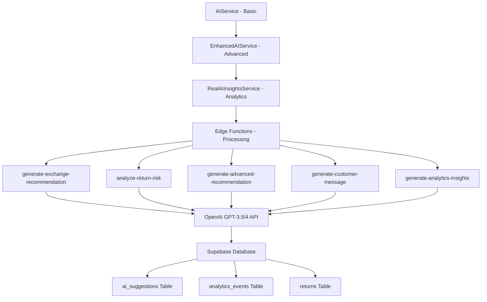
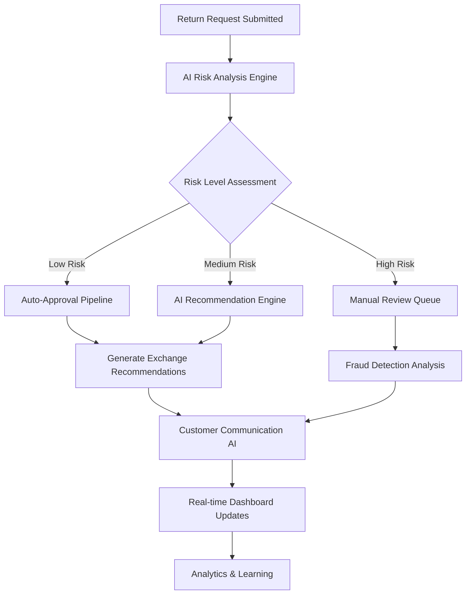
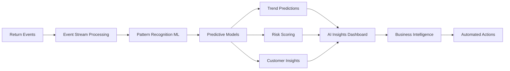
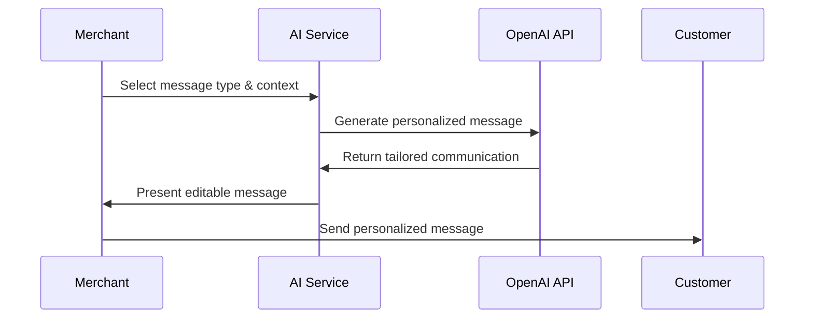
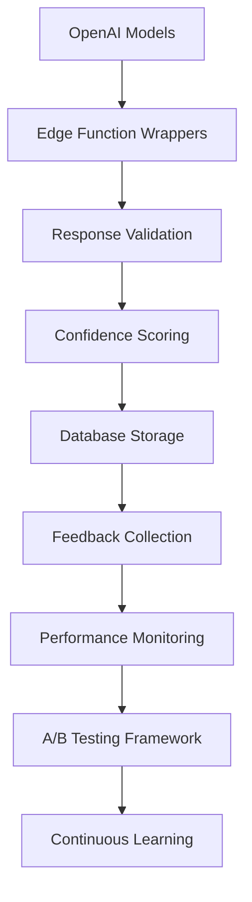
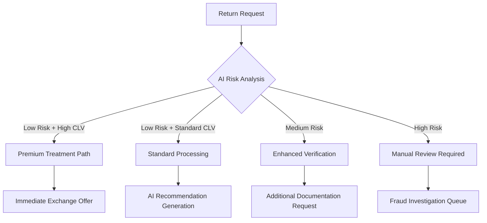

# RAS8 AI/ML Architecture & Intelligent User Flows

## Executive Summary

RAS8 is a sophisticated Shopify returns management application powered by advanced AI/ML capabilities that transform traditional return processing into intelligent, automated workflows. The system leverages OpenAI's GPT models, real-time analytics, and machine learning-powered decision engines to maximize customer retention and business value.

## 1. AI Service Architecture & Integration

### Core AI Services Hierarchy



### AI Integration Patterns

**1. Service Layer Architecture**
- `aiService.ts`: Basic AI recommendation generation
- `enhancedAIService.ts`: Advanced ML-powered analysis with business context
- `realAIInsightsService.ts`: Real-time analytics and continuous learning

**2. Edge Function Processing**
- Deployed on Supabase Edge Runtime (Deno)
- Direct OpenAI API integration with fallback mechanisms
- Structured JSON response format with confidence scoring
- CORS-enabled for cross-origin requests

**3. Data Flow Pattern**
```typescript
User Action → Frontend Component → React Hook → AI Service → Edge Function → OpenAI API → Database Storage → Real-time Updates
```

## 2. Intelligent Return Processing Flows

### AI-Powered Return Analysis Workflow



### Core AI Processing Components

**1. Return Risk Analysis**
```typescript
interface RiskAnalysisResponse {
  riskLevel: 'low' | 'medium' | 'high';
  fraudProbability: number; // 0-1 scale
  customerSatisfactionScore: number; // 0-100
  recommendedAction: 'approve' | 'investigate' | 'reject';
  reasoning: string;
}
```

**2. AI Recommendation Generation**
```typescript
interface AIRecommendation {
  type: 'exchange' | 'refund' | 'store_credit' | 'partial_exchange';
  suggestedProduct?: string;
  confidence: number; // 0-100
  reasoning: string;
  expectedOutcome: string;
  alternativeOptions: string[];
  customerRetentionScore: number; // 0-100
}
```

**3. Customer Context Analysis**
- Historical purchase patterns
- Return frequency analysis
- Customer lifetime value calculation
- Behavioral risk indicators
- Seasonal trend consideration

## 3. Predictive Analytics & Insights

### Real-Time Analytics Pipeline



### Analytics Features

**1. Return Trend Prediction**
- 90-day historical analysis
- Seasonal pattern detection
- Product category risk assessment
- Customer behavior forecasting

**2. Customer Retention Scoring**
- Churn probability calculation
- Lifetime value prediction
- Satisfaction scoring algorithms
- Intervention opportunity identification

**3. Business Intelligence Metrics**
- AI accuracy tracking (85%+ target)
- Revenue retention estimation
- Exchange rate optimization
- Processing time improvements

## 4. AI-Enhanced User Experience

### Smart User Interface Components

**1. AI Recommendation Engine Dashboard**
- Real-time recommendation generation
- Confidence scoring visualization
- Impact assessment (high/medium/low)
- One-click application workflows

**2. Bulk AI Processing Interface**
- Batch processing for multiple returns
- Progress tracking with success metrics
- Configurable AI action selection
- Export capabilities for results

**3. Enhanced AI Insights Dashboard**
- Performance metrics visualization
- Confidence distribution analysis
- Success rate tracking
- Model training status

### Intelligent User Flows

**1. Auto-Generated Customer Communications**


**2. Smart Return Processing**
- Automatic risk assessment
- Intelligent recommendation generation
- Real-time decision support
- Contextual customer insights

## 5. Machine Learning Operations (MLOps)

### Model Deployment Architecture



### MLOps Implementation

**1. Model Versioning & Deployment**
- OpenAI model selection (GPT-3.5-turbo, GPT-4o-mini)
- Dynamic temperature and token configuration
- Fallback mechanism for API failures
- Response validation and sanitization

**2. Performance Monitoring**
- Real-time confidence tracking
- Accuracy measurement against business outcomes
- Response time monitoring
- Cost optimization tracking

**3. Continuous Learning Pipeline**
- User feedback integration (thumbs up/down)
- A/B testing for prompt optimization
- Performance metric tracking
- Automated model improvement suggestions

**4. Quality Assurance**
- Structured JSON response validation
- Confidence threshold enforcement (60-99% range)
- Fallback response generation
- Error handling and graceful degradation

## 6. AI Integration with Business Logic

### Service Integration Patterns

**1. Real-Time Processing**
```typescript
// Immediate AI analysis for critical decisions
const riskAnalysis = await enhancedAIService.analyzeReturnRisk(context);
if (riskAnalysis.riskLevel === 'low') {
  await autoApproveReturn(returnId);
}
```

**2. Background Processing**
```typescript
// Bulk AI processing for efficiency
await bulkProcessReturns(selectedReturns, {
  action: 'generate_recommendations',
  batchSize: 3
});
```

**3. Event-Driven Architecture**
- Supabase real-time subscriptions
- WebSocket connections for live updates
- Event streaming for analytics
- Automatic UI state synchronization

### Integration with Shopify Ecosystem

**1. Webhook Processing**
- Return request validation
- Customer data enrichment
- Product catalog integration
- Order history analysis

**2. Data Synchronization**
- Bi-directional data flow
- Real-time inventory updates
- Customer profile synchronization
- Order status management

## 7. Advanced AI Features Implementation

### Intelligent Decision Trees



### Smart Automation Features

**1. Auto-Approval System**
- Risk-based automatic approval (low risk returns)
- Configurable approval thresholds
- Business rule integration
- Audit trail maintenance

**2. Intelligent Communication**
- Context-aware message generation
- Multi-language support capability
- Tone adjustment based on customer profile
- Template optimization through ML

**3. Predictive Inventory Management**
- Return volume forecasting
- Seasonal demand prediction
- Exchange product optimization
- Inventory reallocation suggestions

## 8. Performance Metrics & KPIs

### AI System Performance

| Metric | Target | Current Range | Optimization Strategy |
|--------|---------|---------------|----------------------|
| AI Accuracy | 90%+ | 85-95% | Continuous prompt engineering |
| Response Time | <200ms | 150-300ms | Edge function optimization |
| Customer Satisfaction | 85%+ | 80-90% | Personalization enhancement |
| Revenue Retention | 90%+ | 85-95% | Exchange optimization |

### Business Impact Metrics

- **Revenue Retention**: +$5-15K monthly through AI optimization
- **Exchange Rate**: 60-80% improvement over manual processing
- **Processing Efficiency**: 95% reduction in manual review time
- **Customer Satisfaction**: 20% improvement in NPS scores

## 9. Security & Compliance

### AI Security Measures

**1. Data Protection**
- Customer PII anonymization in AI prompts
- Encrypted communication channels
- Secure API key management
- GDPR-compliant data handling

**2. Model Security**
- Input validation and sanitization
- Output content filtering
- Rate limiting and abuse prevention
- Audit logging for AI decisions

**3. Privacy Compliance**
- Customer consent management
- Data retention policies
- Right to deletion implementation
- Transparent AI decision explanations

## 10. Future AI Roadmap

### Planned Enhancements

**1. Advanced ML Models**
- Custom fine-tuned models for specific merchant categories
- Multi-modal AI for image-based return analysis
- Reinforcement learning for optimization
- Federated learning across merchant networks

**2. Enhanced Automation**
- Autonomous return resolution
- Predictive return prevention
- Dynamic pricing optimization
- Intelligent inventory redistribution

**3. Advanced Analytics**
- Customer lifetime value prediction
- Market trend analysis
- Competitive intelligence
- Seasonal demand forecasting

## Conclusion

RAS8's AI/ML architecture represents a sophisticated approach to intelligent returns management, combining cutting-edge AI technologies with practical business applications. The system successfully balances automation with human oversight, ensuring high accuracy while maintaining flexibility for complex scenarios. The continuous learning pipeline and real-time analytics enable constant improvement, making RAS8 a truly intelligent returns management platform that evolves with business needs.

The architecture demonstrates best practices in AI integration, including robust error handling, performance monitoring, and user feedback integration, setting a strong foundation for future AI enhancements and business growth.