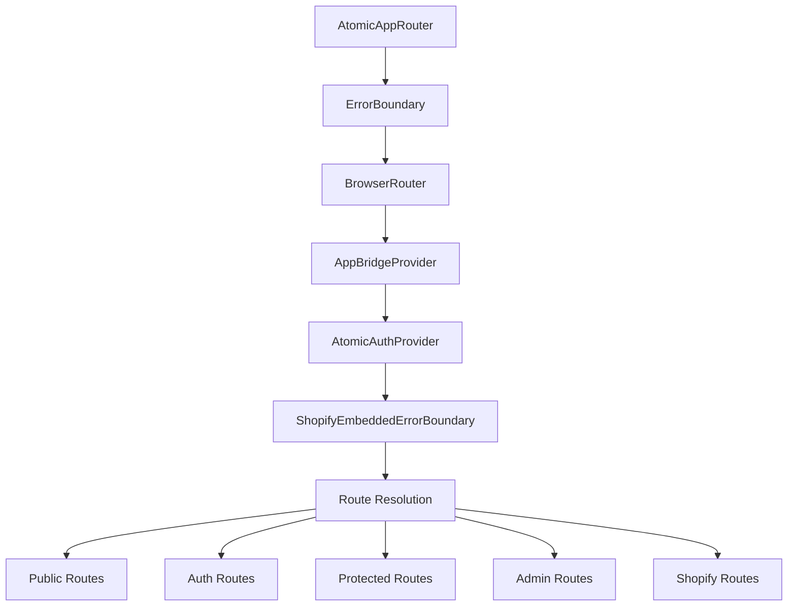
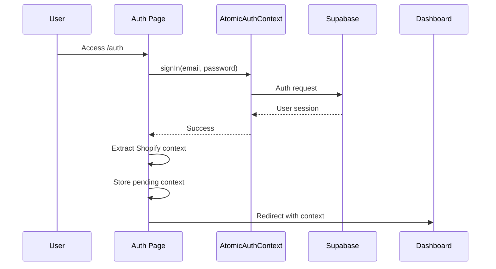
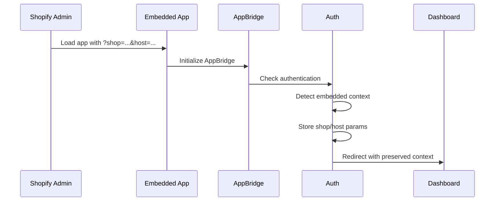
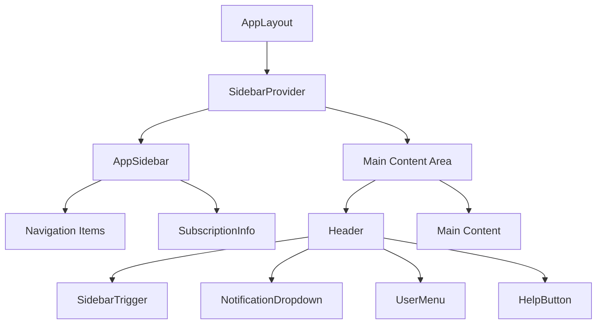
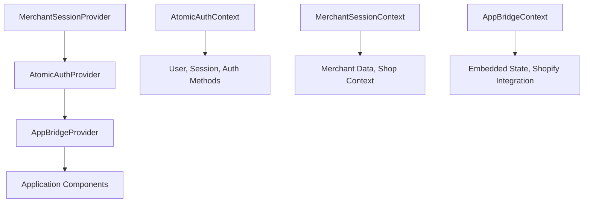
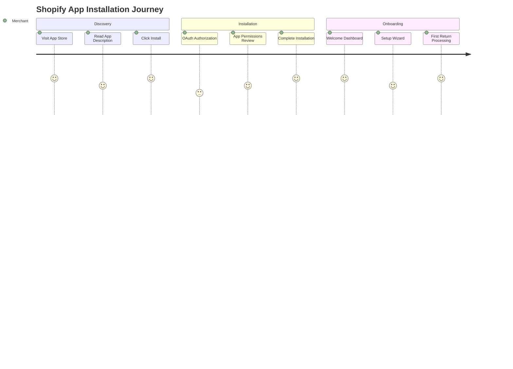
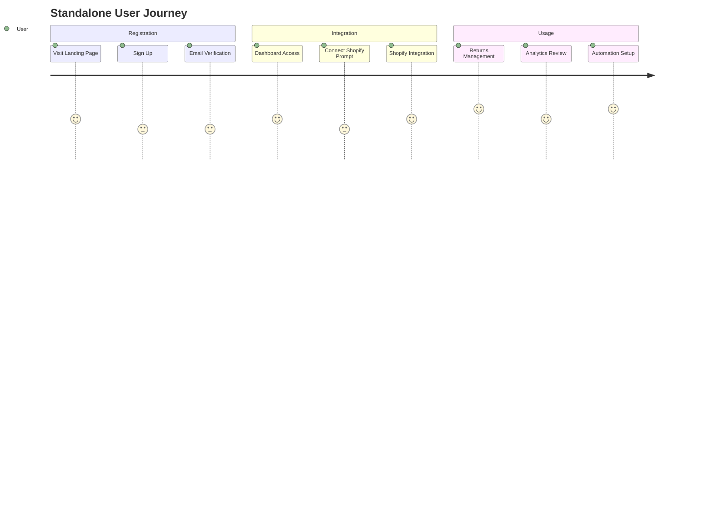
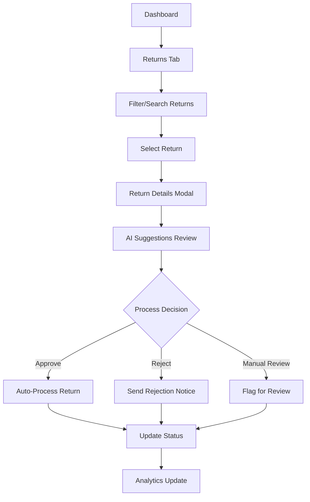
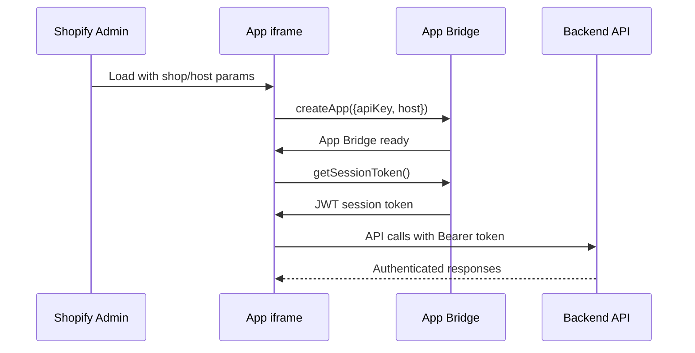
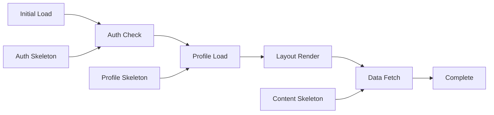

# RAS8 Frontend Navigation Patterns & User Interface Flow Analysis

## Executive Summary

The RAS8 Shopify Returns Management Application implements a sophisticated frontend architecture with dual-mode operation (embedded Shopify app vs standalone), advanced routing protection, intelligent landing resolution, and comprehensive state management. This analysis documents the complete user navigation patterns, interface flows, and interaction patterns.

## 1. Application Entry Points & Routing Architecture

### 1.1 Router Configuration (`AtomicAppRouter.tsx`)

The application uses a unified routing system with multiple layers of protection and context awareness:



### 1.2 Route Categories

**Public Routes (No Authentication Required):**
- `/landing` - Marketing/waitlist landing page
- `/return-portal` - Customer return portal
- `/shopify/install` - Shopify app installation
- `/health`, `/status` - Health check endpoints

**Authentication Routes:**
- `/auth` - Sign in/sign up with embedded context handling
- `/auth/inline` - Shopify embedded re-authentication
- `/auth/callback` - OAuth callback handling
- `/connect-shopify` - Merchant connection flow
- `/reconnect` - Token refresh/reconnection

**Protected Application Routes:**
- `/dashboard` - Main dashboard (dual mode)
- `/returns` - Returns management interface
- `/analytics` - Analytics and reporting
- `/ai-insights` - AI-powered insights
- `/products` - Product management
- `/customers` - Customer management
- `/automations` - Automation workflows

**Master Admin Routes:**
- `/master-admin` - System administration
- `/debug` - Debug panel
- `/database` - Database management
- `/logs` - System logs
- `/api-monitor` - API monitoring

## 2. User Interface Flow Patterns

### 2.1 Application Landing Resolution

The application implements intelligent landing resolution through `landingResolver.ts`:

```mermaid
graph TD
    A[User Authenticated] --> B{Profile Exists?}
    B -->|No| C[/error - no-profile]
    B -->|Yes| D{Master Admin?}
    D -->|Yes| E[/master-admin]
    D -->|No| F{Check Integration Status}
    
    F --> G[validateMerchantIntegration]
    G --> H{Integration Status}
    H -->|integrated-active| I[/dashboard]
    H -->|no-merchant-link| J[/connect-shopify]
    H -->|uninstalled/invalid| K[/reconnect]
    H -->|unknown| L[/error]
```

**Integration Status Detection Logic:**

1. **Embedded Context Detection:**
   - URL parameters (`shop`, `host`, `embedded`)
   - Frame detection (`window.self !== window.top`)
   - Shopify referrer domains
   - localStorage preserved context

2. **Merchant Integration Validation:**
   - Database function: `validate_merchant_integration`
   - Fallback validation for existing merchants
   - Token freshness and validity checks
   - Shop domain extraction and persistence

### 2.2 Authentication Flow Patterns

**Standard Authentication Flow:**


**Embedded App Authentication:**


### 2.3 Dashboard Navigation Structure

**Layout Hierarchy:**


**Sidebar Navigation Items:**
- Dashboard (`/dashboard`) - Home icon
- Returns (`/returns`) - Package icon
- Analytics (`/analytics`) - BarChart icon
- AI Insights (`/ai-insights`) - TrendingUp icon
- Products (`/products`) - Inbox icon
- Customers (`/customers`) - Users icon
- Automations (`/automations`) - Activity icon
- Integrations (`/integrations`) - Webhook icon

## 3. Component Interaction Patterns

### 3.1 State Management Architecture

**Context Providers Hierarchy:**


**Key Context APIs:**

1. **AtomicAuthContext:**
   - `user: User | null` - Current authenticated user
   - `session: Session | null` - Supabase session
   - `loading: boolean` - Authentication loading state
   - `signIn`, `signUp`, `signOut` - Authentication methods

2. **MerchantSessionContext:**
   - `session: MerchantSessionData | null` - Merchant session
   - `isAuthenticated: boolean` - Merchant auth status
   - `refreshSession()` - Session refresh method

3. **AppBridgeContext:**
   - `isEmbedded: boolean` - Embedded app detection
   - `loading: boolean` - AppBridge initialization
   - Session token management

### 3.2 Data Fetching Patterns

**React Query Integration:**
```typescript
// Custom hooks pattern
const { returns, loading, error, refetch } = useRealReturnsData();
const { profile, loading: profileLoading } = useMerchantProfile();

// Optimistic updates
const handleProcessingComplete = async (result: any) => {
  toast({ title: "Return Processed", description: `Return ${result.action} successfully` });
  await refetch(); // Refresh data
};
```

**Real-time Data Patterns:**
- Polling for live dashboard updates
- Optimistic UI updates for return processing
- Background sync with loading states
- Error boundaries with retry mechanisms

### 3.3 Form Handling Patterns

**React Hook Form + Zod Validation:**
```typescript
// Authentication forms
const [signInForm, setSignInForm] = useState({
  email: '',
  password: ''
});

// Form submission with error handling
const handleSignIn = async (e: React.FormEvent) => {
  e.preventDefault();
  setLoading(true);
  
  try {
    const { error } = await signIn(email, password);
    if (error) {
      setError(error.message);
      toast({ variant: "destructive", title: "Sign in failed" });
    }
  } finally {
    setLoading(false);
  }
};
```

## 4. User Experience Journeys

### 4.1 Merchant Onboarding Experience

**First-Time Shopify Installation:**


**Standalone User Onboarding:**


### 4.2 Daily Workflow Patterns

**Returns Processing Workflow:**


### 4.3 Mobile Responsiveness Patterns

**Responsive Breakpoints:**
- Mobile: `< 768px` - Collapsed sidebar, simplified header
- Tablet: `768px - 1024px` - Collapsible sidebar
- Desktop: `> 1024px` - Full sidebar navigation

**Mobile Optimizations:**
- Touch-friendly button sizes (44px minimum)
- Swipe gestures for table navigation
- Responsive grid layouts
- Optimized form inputs for mobile keyboards
- Progressive enhancement approach

## 5. Authentication & Session Flow

### 5.1 Shopify App Bridge Integration

**Embedded App Flow:**


**Session Persistence Strategy:**
- AppBridge session tokens for embedded apps
- Supabase session for standalone users
- localStorage for context preservation
- Circuit breaker for redirect loops
- Graceful degradation for network issues

### 5.2 Multi-Tenant Context Switching

**Merchant Context Management:**
```typescript
// Embedded context detection
const isEmbedded = useMemo(() => 
  typeof window !== 'undefined' && window.self !== window.top, 
  []
);

// Shop parameter preservation
const shopifyParams = useMemo(() => {
  const searchParams = new URLSearchParams(window.location.search);
  const params = new URLSearchParams();
  
  if (searchParams.get('shop')) params.set('shop', searchParams.get('shop')!);
  if (searchParams.get('host')) params.set('host', searchParams.get('host')!);
  
  return params;
}, []);
```

## 6. Performance & Interaction Patterns

### 6.1 Loading States & Skeleton UIs

**Progressive Loading Strategy:**


**Loading Component Patterns:**
```typescript
// Centralized loading states
<LoadingSpinner size="lg" text="Loading your dashboard..." />

// Table loading with skeleton rows
{loading && (
  <div className="flex items-center justify-center py-12">
    <Loader2 className="h-6 w-6 animate-spin mr-2" />
    <span className="text-muted-foreground">Loading returns...</span>
  </div>
)}
```

### 6.2 Error Handling Patterns

**Error Boundary Strategy:**
```typescript
const ErrorFallback = ({ error, resetErrorBoundary }) => {
  const isHookError = error.message.includes('hook');
  const isNetworkError = error.message.includes('network');
  
  return (
    <div className="min-h-screen flex items-center justify-center">
      <div className="text-center space-y-4">
        <div className="text-4xl">{isHookError ? '⚠️' : '💥'}</div>
        <h2 className="text-xl font-semibold text-red-600">
          {isHookError ? 'Component Error' : 'Application Error'}
        </h2>
        <p className="text-muted-foreground">{error.message}</p>
      </div>
    </div>
  );
};
```

### 6.3 Real-Time Updates & Optimistic UI

**Optimistic Update Pattern:**
```typescript
const handleReturnProcessing = async (returnId: string, action: string) => {
  // Optimistic UI update
  setReturns(prev => 
    prev.map(ret => 
      ret.id === returnId 
        ? { ...ret, status: action === 'approve' ? 'approved' : 'rejected' }
        : ret
    )
  );
  
  try {
    await processReturn(returnId, action);
    toast({ title: "Return processed successfully" });
  } catch (error) {
    // Revert optimistic update
    await refetch();
    toast({ variant: "destructive", title: "Processing failed" });
  }
};
```

## 7. Advanced Features & Animations

### 7.1 Framer Motion Animations

**Page Transitions:**
```typescript
// Fade-in animations for sections
<section className="animate-fade-in">
  <Card className="shadow-sm hover:shadow-md transition-shadow duration-300">
    // Content
  </Card>
</section>

// Loading state transitions
<motion.div
  initial={{ opacity: 0, y: 20 }}
  animate={{ opacity: 1, y: 0 }}
  transition={{ duration: 0.3 }}
>
  {children}
</motion.div>
```

### 7.2 Advanced Filtering & Search

**Real-Time Search Implementation:**
```typescript
const filteredReturns = useMemo(() => {
  return returns.filter(returnItem => {
    const matchesSearch = !searchTerm || 
      returnItem.customer_email.toLowerCase().includes(searchTerm.toLowerCase()) ||
      returnItem.shopify_order_id.toLowerCase().includes(searchTerm.toLowerCase());
    
    const matchesStatus = statusFilter === 'all' || returnItem.status === statusFilter;
    
    return matchesSearch && matchesStatus;
  });
}, [returns, searchTerm, statusFilter]);
```

## 8. Key UX Design Decisions

### 8.1 Embedded vs Standalone Mode

**Design Rationale:**
- **Embedded Mode**: Minimal header, optimized for iframe constraints, Shopify-native feel
- **Standalone Mode**: Full navigation, comprehensive header with help/notifications
- **Responsive Adaptation**: Automatic layout adjustment based on viewport and context

### 8.2 Navigation Patterns

**Sidebar Design:**
- Collapsible icon-based navigation for space efficiency
- Tooltips for collapsed states
- Visual indicators for active routes
- Usage info at bottom for subscription awareness

### 8.3 Error Recovery Patterns

**Circuit Breaker Implementation:**
- Maximum 3 redirects to prevent infinite loops
- Graceful degradation with fallback routes
- User-friendly error messages with retry options
- Comprehensive logging for debugging

## 9. Performance Optimizations

### 9.1 Code Splitting & Lazy Loading

**Route-Based Splitting:**
```typescript
// Lazy-loaded page components
const Dashboard = lazy(() => import('@/pages/Dashboard'));
const Returns = lazy(() => import('@/pages/Returns'));
const Analytics = lazy(() => import('@/pages/Analytics'));

// Suspense boundaries
<Suspense fallback={<LoadingSpinner />}>
  <Routes>
    <Route path="/dashboard" element={<Dashboard />} />
  </Routes>
</Suspense>
```

### 9.2 Bundle Optimization

**Performance Metrics Target:**
- Initial bundle: < 200KB gzipped
- First Contentful Paint: < 1.8s
- Time to Interactive: < 3.9s
- Cumulative Layout Shift: < 0.1

## 10. Testing & Quality Assurance

### 10.1 Component Testing Strategy

**Testing Library Integration:**
```typescript
// Component interaction testing
test('should filter returns by search term', async () => {
  render(<RealReturnsTable searchTerm="test@example.com" statusFilter="all" />);
  
  await waitFor(() => {
    expect(screen.getByText('test@example.com')).toBeInTheDocument();
  });
});
```

### 10.2 End-to-End Testing

**Critical User Journeys:**
- Shopify app installation flow
- Return processing workflow  
- Authentication and session management
- Multi-tenant context switching
- Error recovery scenarios

## Conclusion

The RAS8 frontend architecture demonstrates sophisticated handling of dual-mode operation, intelligent routing, and comprehensive state management. The application successfully balances rapid development requirements with maintainable code architecture, providing a robust foundation for a Shopify returns management platform.

Key architectural strengths:
- **Unified routing** with context-aware protection
- **Intelligent landing resolution** based on merchant integration status
- **Dual-mode optimization** for embedded and standalone operation
- **Comprehensive error handling** with circuit breakers
- **Real-time updates** with optimistic UI patterns
- **Mobile-first responsive design** with progressive enhancement

The frontend successfully implements modern React patterns while maintaining compatibility with Shopify's embedded app requirements, resulting in a scalable and maintainable codebase.