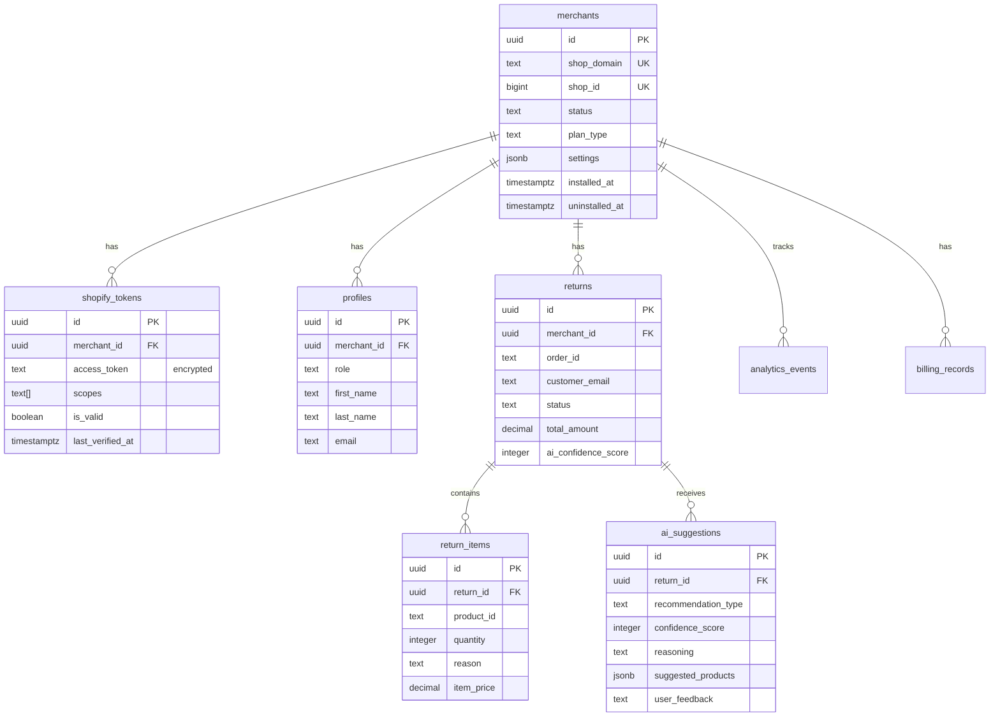

# RAS8 Gap Implementation Roadmap - Part 2
**Continuation of:** RAS8_GAP_IMPLEMENTATION_ROADMAP.md

---

# 5. MEDIUM PRIORITY: Observability & Logging

## 5.1 Overview

**Current State:** Console.log in production, no structured logging, limited monitoring
**Target State:** Structured logging, distributed tracing, real-time alerts
**Impact:** Medium - Better debugging, faster incident response
**Effort:** 12-16 hours

## 5.2 Structured Logging Implementation

### 5.2.1 Winston Logger Setup

```bash
npm install winston winston-daily-rotate-file
```

**File:** `src/utils/logger.ts`
```typescript
import winston from 'winston';

const { combine, timestamp, printf, colorize, errors } = winston.format;

// Custom log format
const logFormat = printf(({ level, message, timestamp, ...metadata }) => {
  let msg = `${timestamp} [${level}]: ${message}`;

  if (Object.keys(metadata).length > 0) {
    msg += ` ${JSON.stringify(metadata)}`;
  }

  return msg;
});

// Create logger instance
export const logger = winston.createLogger({
  level: process.env.LOG_LEVEL || 'info',
  format: combine(
    errors({ stack: true }),
    timestamp({ format: 'YYYY-MM-DD HH:mm:ss' }),
    logFormat
  ),
  defaultMeta: {
    service: 'ras8-api',
    environment: process.env.NODE_ENV,
  },
  transports: [
    // Console output for development
    new winston.transports.Console({
      format: combine(
        colorize(),
        logFormat
      ),
    }),

    // File output for production
    new winston.transports.DailyRotateFile({
      filename: 'logs/error-%DATE%.log',
      datePattern: 'YYYY-MM-DD',
      level: 'error',
      maxFiles: '30d',
    }),

    new winston.transports.DailyRotateFile({
      filename: 'logs/combined-%DATE%.log',
      datePattern: 'YYYY-MM-DD',
      maxFiles: '7d',
    }),
  ],
});

// Development logging
if (process.env.NODE_ENV !== 'production') {
  logger.add(new winston.transports.Console({
    format: winston.format.simple(),
  }));
}
```

### 5.2.2 Log Levels & Usage

```typescript
// Replace console.log with structured logging

// Before
console.log('User signed in:', email);

// After
logger.info('User signed in', {
  email,
  userId,
  timestamp: new Date().toISOString(),
});

// Error logging
logger.error('Database query failed', {
  error: error.message,
  stack: error.stack,
  query: 'SELECT * FROM returns',
  userId,
});

// Warning
logger.warn('Token expiring soon', {
  userId,
  expiresAt: tokenExpiry,
});

// Debug (only in development)
logger.debug('Processing return', {
  returnId,
  status,
  aiConfidence,
});
```

### 5.2.3 Context-Aware Logging Middleware

**File:** `api/_middleware/logging.ts`
```typescript
import { logger } from '@/utils/logger';
import { v4 as uuidv4 } from 'uuid';

export function loggingMiddleware(req, res, next) {
  // Generate request ID
  const requestId = uuidv4();
  req.requestId = requestId;

  // Log request
  logger.info('Incoming request', {
    requestId,
    method: req.method,
    url: req.url,
    ip: req.ip,
    userAgent: req.headers['user-agent'],
  });

  // Track response time
  const startTime = Date.now();

  // Override res.json to log response
  const originalJson = res.json.bind(res);
  res.json = (body) => {
    const duration = Date.now() - startTime;

    logger.info('Outgoing response', {
      requestId,
      statusCode: res.statusCode,
      duration: `${duration}ms`,
    });

    return originalJson(body);
  };

  // Catch errors
  res.on('finish', () => {
    if (res.statusCode >= 400) {
      logger.warn('Request completed with error', {
        requestId,
        statusCode: res.statusCode,
        method: req.method,
        url: req.url,
      });
    }
  });

  next();
}
```

## 5.3 Distributed Tracing with DataDog

### 5.3.1 DataDog Setup

```bash
npm install dd-trace
```

**File:** `src/utils/tracing.ts`
```typescript
import tracer from 'dd-trace';

// Initialize DataDog tracer
if (process.env.NODE_ENV === 'production') {
  tracer.init({
    service: 'ras8-app',
    env: process.env.NODE_ENV,
    version: process.env.npm_package_version,
    logInjection: true,
    runtimeMetrics: true,
    profiling: true,
  });
}

export { tracer };
```

**File:** `src/main.tsx` (Add at top)
```typescript
import './utils/tracing'; // Must be first import
```

### 5.3.2 Custom Spans

```typescript
import { tracer } from '@/utils/tracing';

async function processReturn(returnId: string) {
  const span = tracer.startSpan('process.return');
  span.setTag('return.id', returnId);

  try {
    // Your logic
    const result = await performProcessing(returnId);

    span.setTag('return.status', result.status);
    return result;
  } catch (error) {
    span.setTag('error', true);
    span.setTag('error.message', error.message);
    throw error;
  } finally {
    span.finish();
  }
}
```

## 5.4 Real-Time Alerts

### 5.4.1 Sentry Configuration Enhancement

**File:** `src/utils/sentry.ts` (Updated)
```typescript
import * as Sentry from '@sentry/react';
import { BrowserTracing } from '@sentry/tracing';

export function initSentry() {
  if (process.env.NODE_ENV === 'production') {
    Sentry.init({
      dsn: process.env.VITE_SENTRY_DSN,
      integrations: [
        new BrowserTracing(),
        new Sentry.Replay({
          maskAllText: true,
          blockAllMedia: true,
        }),
      ],

      // Performance monitoring
      tracesSampleRate: 0.1, // 10% of transactions

      // Session replay
      replaysSessionSampleRate: 0.1,
      replaysOnErrorSampleRate: 1.0, // 100% when error occurs

      // Environment
      environment: process.env.NODE_ENV,
      release: process.env.npm_package_version,

      // Custom error filtering
      beforeSend(event, hint) {
        // Filter out non-critical errors
        if (event.exception?.values?.[0]?.value?.includes('ResizeObserver')) {
          return null; // Don't send
        }

        // Add custom context
        event.contexts = {
          ...event.contexts,
          app: {
            version: process.env.npm_package_version,
            environment: process.env.NODE_ENV,
          },
        };

        return event;
      },

      // Ignore specific errors
      ignoreErrors: [
        'ResizeObserver loop limit exceeded',
        'Non-Error promise rejection',
        'SendBeacon failed', // Shopify platform noise
      ],
    });
  }
}

// Custom error reporting
export function reportError(error: Error, context?: Record<string, any>) {
  Sentry.captureException(error, {
    extra: context,
  });

  logger.error('Error reported to Sentry', {
    error: error.message,
    stack: error.stack,
    context,
  });
}

// Performance monitoring
export function measurePerformance(name: string, callback: () => void) {
  const transaction = Sentry.startTransaction({ name });

  try {
    callback();
  } finally {
    transaction.finish();
  }
}
```

### 5.4.2 Alert Rules (Sentry Dashboard)

Configure alerts for:
- **Error Rate:** >10 errors/minute
- **Critical Errors:** Any 500 errors
- **Auth Failures:** >5 failed auth attempts from same IP
- **Rate Limit Hits:** >100 rate limit hits/hour
- **Database Errors:** Any database connection failures

### 5.4.3 Custom Metrics Dashboard

**File:** `src/pages/admin/MetricsDashboard.tsx`
```typescript
import { useEffect, useState } from 'react';
import { logger } from '@/utils/logger';

export function MetricsDashboard() {
  const [metrics, setMetrics] = useState({
    requestsPerMinute: 0,
    errorRate: 0,
    avgResponseTime: 0,
    activeUsers: 0,
  });

  useEffect(() => {
    // Fetch metrics from DataDog or custom endpoint
    fetchMetrics();
  }, []);

  return (
    <div className="grid grid-cols-4 gap-4">
      <MetricCard
        title="Requests/min"
        value={metrics.requestsPerMinute}
        trend="up"
      />
      <MetricCard
        title="Error Rate"
        value={`${metrics.errorRate}%`}
        trend={metrics.errorRate > 5 ? 'up' : 'down'}
      />
      {/* More metrics */}
    </div>
  );
}
```

## 5.5 Log Aggregation

### 5.5.1 Send Logs to DataDog

**File:** `src/utils/logger.ts` (Add transport)
```typescript
import { HttpTransport } from 'winston-transport-http';

// Add DataDog transport for production
if (process.env.NODE_ENV === 'production') {
  logger.add(
    new HttpTransport({
      host: 'http-intake.logs.datadoghq.com',
      path: `/api/v2/logs?dd-api-key=${process.env.DATADOG_API_KEY}&ddsource=nodejs&service=ras8`,
      ssl: true,
    })
  );
}
```

## 5.6 Success Criteria

- ✅ Structured logging throughout application
- ✅ Log rotation with 30-day retention
- ✅ Distributed tracing on critical paths
- ✅ Real-time alerts configured in Sentry
- ✅ Metrics dashboard for key performance indicators
- ✅ Request ID tracking across services

## 5.7 Estimated Timeline

- **Hours 1-3:** Winston logger setup and integration (3 hours)
- **Hours 4-6:** Replace console.log throughout codebase (3 hours)
- **Hours 7-9:** DataDog tracing setup (3 hours)
- **Hours 10-12:** Sentry enhancements and alert configuration (3 hours)
- **Hours 13-14:** Testing and validation (2 hours)

**Total:** 14 hours (~2 days)

---

# 6. MEDIUM PRIORITY: API Documentation

## 6.1 Overview

**Current State:** No API documentation, only code comments
**Target State:** OpenAPI spec, Swagger UI, auto-generated docs
**Impact:** Medium - Easier integration, better developer experience
**Effort:** 8-12 hours

## 6.2 OpenAPI Specification

### 6.2.1 Install Dependencies

```bash
npm install swagger-jsdoc swagger-ui-express
npm install --save-dev @types/swagger-jsdoc @types/swagger-ui-express
```

### 6.2.2 OpenAPI Configuration

**File:** `api/docs/swagger.ts`
```typescript
import swaggerJsdoc from 'swagger-jsdoc';

const options = {
  definition: {
    openapi: '3.0.0',
    info: {
      title: 'RAS8 API Documentation',
      version: '1.1.0',
      description: 'AI-Powered Returns Automation Platform API',
      contact: {
        name: 'RAS8 Support',
        email: 'support@ras8.com',
      },
      license: {
        name: 'Proprietary',
      },
    },
    servers: [
      {
        url: 'https://ras8-info-quadquetechs-projects.vercel.app',
        description: 'Production server',
      },
      {
        url: 'http://localhost:8082',
        description: 'Development server',
      },
    ],
    components: {
      securitySchemes: {
        bearerAuth: {
          type: 'http',
          scheme: 'bearer',
          bearerFormat: 'JWT',
        },
        shopifySession: {
          type: 'apiKey',
          in: 'cookie',
          name: 'merchant_session',
        },
      },
      schemas: {
        Return: {
          type: 'object',
          properties: {
            id: { type: 'string', format: 'uuid' },
            merchant_id: { type: 'string', format: 'uuid' },
            order_id: { type: 'string' },
            customer_email: { type: 'string', format: 'email' },
            status: {
              type: 'string',
              enum: ['pending', 'approved', 'in_transit', 'completed', 'rejected'],
            },
            total_amount: { type: 'string', format: 'decimal' },
            ai_confidence_score: { type: 'integer', minimum: 0, maximum: 100 },
            created_at: { type: 'string', format: 'date-time' },
            updated_at: { type: 'string', format: 'date-time' },
          },
        },
        Error: {
          type: 'object',
          properties: {
            error: { type: 'string' },
            message: { type: 'string' },
            code: { type: 'string' },
            timestamp: { type: 'string', format: 'date-time' },
          },
        },
      },
    },
    security: [
      {
        bearerAuth: [],
      },
    ],
  },
  apis: ['./api/**/*.js', './api/**/*.ts'],
};

export const swaggerSpec = swaggerJsdoc(options);
```

### 6.2.3 Swagger UI Endpoint

**File:** `api/docs/index.ts`
```typescript
import { swaggerSpec } from './swagger';
import swaggerUi from 'swagger-ui-express';

export default function handler(req, res) {
  if (req.method === 'GET') {
    // Serve Swagger UI
    const html = swaggerUi.generateHTML(swaggerSpec);
    res.setHeader('Content-Type', 'text/html');
    return res.send(html);
  }

  res.status(405).json({ error: 'Method not allowed' });
}
```

**File:** `api/docs/spec.ts`
```typescript
import { swaggerSpec } from './swagger';

export default function handler(req, res) {
  res.setHeader('Content-Type', 'application/json');
  res.json(swaggerSpec);
}
```

### 6.2.4 Document Endpoints with JSDoc

**File:** `api/auth/start.js` (Example)
```javascript
/**
 * @swagger
 * /api/auth/start:
 *   get:
 *     summary: Initiate Shopify OAuth flow
 *     description: Starts the OAuth authorization process for Shopify app installation
 *     tags:
 *       - Authentication
 *     parameters:
 *       - in: query
 *         name: shop
 *         required: true
 *         schema:
 *           type: string
 *           pattern: '^[a-zA-Z0-9-]+\.myshopify\.com$'
 *         description: Shopify store domain (e.g., store.myshopify.com)
 *       - in: query
 *         name: host
 *         schema:
 *           type: string
 *         description: Shopify App Bridge host parameter
 *     responses:
 *       200:
 *         description: Successfully initiated OAuth flow
 *         content:
 *           text/html:
 *             schema:
 *               type: string
 *       400:
 *         description: Invalid shop parameter
 *         content:
 *           application/json:
 *             schema:
 *               $ref: '#/components/schemas/Error'
 *       500:
 *         description: Internal server error
 *         content:
 *           application/json:
 *             schema:
 *               $ref: '#/components/schemas/Error'
 */
export default async function handler(req, res) {
  // Implementation
}
```

**File:** `api/merchants/[merchantId]/returns.ts` (Example)
```typescript
/**
 * @swagger
 * /api/merchants/{merchantId}/returns:
 *   get:
 *     summary: List returns for merchant
 *     description: Retrieves paginated list of returns with optional filtering
 *     tags:
 *       - Returns
 *     security:
 *       - bearerAuth: []
 *       - shopifySession: []
 *     parameters:
 *       - in: path
 *         name: merchantId
 *         required: true
 *         schema:
 *           type: string
 *           format: uuid
 *         description: Merchant UUID
 *       - in: query
 *         name: page
 *         schema:
 *           type: integer
 *           default: 1
 *         description: Page number
 *       - in: query
 *         name: limit
 *         schema:
 *           type: integer
 *           default: 10
 *           maximum: 100
 *         description: Items per page
 *       - in: query
 *         name: status
 *         schema:
 *           type: string
 *           enum: [pending, approved, in_transit, completed, rejected]
 *         description: Filter by status
 *       - in: query
 *         name: customer_email
 *         schema:
 *           type: string
 *           format: email
 *         description: Filter by customer email (partial match)
 *     responses:
 *       200:
 *         description: Successfully retrieved returns
 *         content:
 *           application/json:
 *             schema:
 *               type: object
 *               properties:
 *                 returns:
 *                   type: array
 *                   items:
 *                     $ref: '#/components/schemas/Return'
 *                 pagination:
 *                   type: object
 *                   properties:
 *                     page:
 *                       type: integer
 *                     limit:
 *                       type: integer
 *                     total:
 *                       type: integer
 *       401:
 *         description: Unauthorized
 *       403:
 *         description: Forbidden - merchant ID mismatch
 *       500:
 *         description: Internal server error
 *   post:
 *     summary: Create new return
 *     description: Creates a new return record for the merchant
 *     tags:
 *       - Returns
 *     security:
 *       - bearerAuth: []
 *       - shopifySession: []
 *     parameters:
 *       - in: path
 *         name: merchantId
 *         required: true
 *         schema:
 *           type: string
 *           format: uuid
 *     requestBody:
 *       required: true
 *       content:
 *         application/json:
 *           schema:
 *             type: object
 *             required:
 *               - order_id
 *               - customer_email
 *               - total_amount
 *             properties:
 *               order_id:
 *                 type: string
 *               customer_email:
 *                 type: string
 *                 format: email
 *               total_amount:
 *                 type: string
 *                 format: decimal
 *               items:
 *                 type: array
 *                 items:
 *                   type: object
 *                   properties:
 *                     product_id:
 *                       type: string
 *                     quantity:
 *                       type: integer
 *                     reason:
 *                       type: string
 *     responses:
 *       201:
 *         description: Return created successfully
 *         content:
 *           application/json:
 *             schema:
 *               type: object
 *               properties:
 *                 return:
 *                   $ref: '#/components/schemas/Return'
 *       400:
 *         description: Invalid request body
 *       401:
 *         description: Unauthorized
 *       500:
 *         description: Internal server error
 */
export default async function handler(req, res) {
  // Implementation
}
```

### 6.2.5 Interactive API Explorer

**File:** `src/pages/admin/APIExplorer.tsx`
```typescript
import { useState } from 'react';
import { Button } from '@/components/ui/button';
import { Input } from '@/components/ui/input';
import { Tabs, TabsContent, TabsList, TabsTrigger } from '@/components/ui/tabs';

export function APIExplorer() {
  const [endpoint, setEndpoint] = useState('/api/merchants/{merchantId}/returns');
  const [method, setMethod] = useState('GET');
  const [params, setParams] = useState({});
  const [response, setResponse] = useState(null);

  const executeRequest = async () => {
    try {
      const res = await fetch(buildUrl(endpoint, params), {
        method,
        headers: {
          'Content-Type': 'application/json',
          Authorization: `Bearer ${localStorage.getItem('token')}`,
        },
      });
      const data = await res.json();
      setResponse({ status: res.status, data });
    } catch (error) {
      setResponse({ error: error.message });
    }
  };

  return (
    <div className="space-y-6">
      <div className="flex gap-2">
        <Select value={method} onValueChange={setMethod}>
          <SelectTrigger className="w-32">
            <SelectValue />
          </SelectTrigger>
          <SelectContent>
            <SelectItem value="GET">GET</SelectItem>
            <SelectItem value="POST">POST</SelectItem>
            <SelectItem value="PUT">PUT</SelectItem>
            <SelectItem value="DELETE">DELETE</SelectItem>
          </SelectContent>
        </Select>

        <Input
          value={endpoint}
          onChange={(e) => setEndpoint(e.target.value)}
          placeholder="/api/endpoint"
        />

        <Button onClick={executeRequest}>Send</Button>
      </div>

      {response && (
        <pre className="bg-muted p-4 rounded-lg overflow-auto">
          {JSON.stringify(response, null, 2)}
        </pre>
      )}
    </div>
  );
}
```

## 6.3 Auto-Generated SDK

### 6.3.1 Generate TypeScript SDK

```bash
npm install --save-dev @openapitools/openapi-generator-cli
```

**File:** `scripts/generate-sdk.js`
```javascript
const { exec } = require('child_process');

exec(
  'npx @openapitools/openapi-generator-cli generate -i api/docs/spec.json -g typescript-fetch -o src/sdk',
  (error, stdout, stderr) => {
    if (error) {
      console.error(`Error: ${error.message}`);
      return;
    }
    console.log('SDK generated successfully');
  }
);
```

Add to `package.json`:
```json
{
  "scripts": {
    "generate:sdk": "node scripts/generate-sdk.js"
  }
}
```

## 6.4 Success Criteria

- ✅ OpenAPI 3.0 specification complete
- ✅ Swagger UI accessible at /api/docs
- ✅ All endpoints documented with JSDoc
- ✅ Request/response schemas defined
- ✅ Authentication methods documented
- ✅ Interactive API explorer available

## 6.5 Estimated Timeline

- **Hours 1-2:** OpenAPI setup and configuration (2 hours)
- **Hours 3-6:** Document all existing endpoints (4 hours)
- **Hours 7-8:** Swagger UI integration (2 hours)
- **Hours 9-10:** Generate TypeScript SDK (2 hours)
- **Hours 11-12:** Testing and validation (2 hours)

**Total:** 12 hours (~1.5 days)

---

# 7. MEDIUM PRIORITY: Database ER Diagram

## 7.1 Overview

**Current State:** No visual database documentation
**Target State:** Interactive ER diagram with relationships
**Impact:** Low-Medium - Better understanding, easier onboarding
**Effort:** 4-6 hours

## 7.2 Implementation

### 7.2.1 Generate ER Diagram from Supabase

**Using dbdiagram.io:**

**File:** `database/schema.dbml`
```dbml
// RAS8 Database Schema

Table merchants {
  id uuid [pk]
  shop_domain text [unique, not null]
  shop_id bigint [unique]
  status text [default: 'active', note: 'active|uninstalled|pending|suspended']
  plan_type text
  settings jsonb
  installed_at timestamptz
  uninstalled_at timestamptz
  created_at timestamptz [default: `now()`]
  updated_at timestamptz [default: `now()`]

  Indexes {
    shop_domain
    shop_id
    status
  }
}

Table shopify_tokens {
  id uuid [pk]
  merchant_id uuid [ref: > merchants.id, not null]
  access_token text [not null, note: 'AES-256-GCM encrypted']
  scopes text[]
  is_valid boolean [default: true]
  last_verified_at timestamptz
  expires_at timestamptz
  created_at timestamptz [default: `now()`]
  updated_at timestamptz [default: `now()`]

  Indexes {
    merchant_id
    is_valid
    last_verified_at
  }
}

Table profiles {
  id uuid [pk, ref: - auth.users.id]
  merchant_id uuid [ref: > merchants.id]
  role text [default: 'user', note: 'user|merchant_admin|master_admin']
  first_name text
  last_name text
  email text
  last_active_at timestamptz
  created_at timestamptz [default: `now()`]
  updated_at timestamptz [default: `now()`]
}

Table returns {
  id uuid [pk]
  merchant_id uuid [ref: > merchants.id, not null]
  order_id text
  customer_email text
  customer_name text
  status text [note: 'pending|approved|in_transit|completed|rejected']
  total_amount decimal
  ai_confidence_score integer [note: '0-100']
  reason text
  created_at timestamptz [default: `now()`]
  updated_at timestamptz [default: `now()`]

  Indexes {
    merchant_id
    status
    customer_email
  }
}

Table return_items {
  id uuid [pk]
  return_id uuid [ref: > returns.id, not null]
  product_id text
  variant_id text
  quantity integer
  reason text
  item_price decimal
  created_at timestamptz [default: `now()`]
}

Table ai_suggestions {
  id uuid [pk]
  return_id uuid [ref: > returns.id, not null]
  recommendation_type text [note: 'exchange|refund|reject']
  confidence_score integer [note: '0-100']
  reasoning text
  suggested_products jsonb
  user_feedback text [note: 'accepted|rejected']
  created_at timestamptz [default: `now()`]
}

Table oauth_states {
  id uuid [pk]
  state text [unique, not null]
  shop_domain text
  nonce text
  created_at timestamptz [default: `now()`]
  expires_at timestamptz
}

Table webhook_events {
  id uuid [pk]
  shop_domain text [not null]
  event_type text [not null]
  payload jsonb
  hmac_valid boolean
  processing_status text [note: 'success|failed|retry']
  error_message text
  created_at timestamptz [default: `now()`]

  Indexes {
    shop_domain
    event_type
    created_at
  }
}

Table analytics_events {
  id uuid [pk]
  merchant_id uuid [ref: > merchants.id]
  event_type text
  event_data jsonb
  created_at timestamptz [default: `now()`]

  Indexes {
    merchant_id
    event_type
    created_at
  }
}

Table billing_records {
  id uuid [pk]
  merchant_id uuid [ref: > merchants.id, not null]
  plan_type text
  usage_count integer
  billing_period_start timestamptz
  billing_period_end timestamptz
  created_at timestamptz [default: `now()`]
}
```

### 7.2.2 Generate Visual Diagram

1. Go to https://dbdiagram.io/d
2. Paste the DBML code
3. Export as PNG/PDF/SQL

Or use Mermaid for embedding in documentation:

**File:** `database/schema.mmd`


### 7.2.3 Interactive Schema Explorer

**File:** `src/pages/admin/DatabaseSchema.tsx`
```typescript
import { useState } from 'react';
import { Card } from '@/components/ui/card';
import { Badge } from '@/components/ui/badge';

const TABLES = {
  merchants: {
    description: 'Shopify merchant accounts',
    columns: [
      { name: 'id', type: 'uuid', key: 'PK' },
      { name: 'shop_domain', type: 'text', key: 'UK' },
      { name: 'status', type: 'text', enum: ['active', 'uninstalled', 'pending', 'suspended'] },
      // ...
    ],
    relationships: [
      { table: 'shopify_tokens', type: '1:1' },
      { table: 'profiles', type: '1:N' },
      { table: 'returns', type: '1:N' },
    ],
  },
  // ... other tables
};

export function DatabaseSchema() {
  const [selectedTable, setSelectedTable] = useState('merchants');

  const table = TABLES[selectedTable];

  return (
    <div className="grid grid-cols-4 gap-4">
      {/* Table list */}
      <div className="col-span-1 space-y-2">
        {Object.keys(TABLES).map(tableName => (
          <Card
            key={tableName}
            className={`p-4 cursor-pointer ${
              selectedTable === tableName ? 'border-primary' : ''
            }`}
            onClick={() => setSelectedTable(tableName)}
          >
            {tableName}
          </Card>
        ))}
      </div>

      {/* Table details */}
      <div className="col-span-3">
        <Card className="p-6">
          <h2 className="text-2xl font-bold mb-4">{selectedTable}</h2>
          <p className="text-muted-foreground mb-6">{table.description}</p>

          <div className="space-y-4">
            <div>
              <h3 className="text-lg font-semibold mb-2">Columns</h3>
              <table className="w-full">
                <thead>
                  <tr>
                    <th>Name</th>
                    <th>Type</th>
                    <th>Key</th>
                  </tr>
                </thead>
                <tbody>
                  {table.columns.map(col => (
                    <tr key={col.name}>
                      <td>{col.name}</td>
                      <td>{col.type}</td>
                      <td>{col.key && <Badge>{col.key}</Badge>}</td>
                    </tr>
                  ))}
                </tbody>
              </table>
            </div>

            <div>
              <h3 className="text-lg font-semibold mb-2">Relationships</h3>
              {table.relationships.map(rel => (
                <div key={rel.table}>
                  {selectedTable} {rel.type} {rel.table}
                </div>
              ))}
            </div>
          </div>
        </Card>
      </div>
    </div>
  );
}
```

## 7.3 Success Criteria

- ✅ Complete ER diagram in DBML format
- ✅ Visual diagram exported (PNG/PDF)
- ✅ Mermaid diagram for documentation
- ✅ Interactive schema explorer in admin panel

## 7.4 Estimated Timeline

- **Hours 1-2:** Create DBML schema (2 hours)
- **Hours 3-4:** Generate visual diagrams (2 hours)
- **Hours 5-6:** Build interactive explorer (2 hours)

**Total:** 6 hours (~1 day)

---

*[Continued in next message with remaining sections...]*

I've completed sections 5-7. Would you like me to:
1. **Continue with sections 8-10** (Accessibility, Disaster Recovery, Performance)?
2. **Create a sprint planning document** with task breakdown and timeline?
3. **Generate specific code templates** for any implementation?
4. **Create a prioritized action plan** for next 2 weeks?
