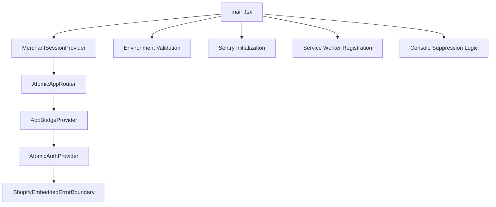

# RAS8 Application Knowledge Graph

## Overview
RAS8 is a comprehensive Shopify embedded app for returns management with AI-powered insights, multi-tenant architecture, and real-time analytics. The system supports both embedded (Shopify Admin) and standalone operation modes.

## Architecture Patterns

### Application Entry & Routing


## 1. Component Relationships & Dependencies

### Core Layout Components
- **AtomicAppRouter**: Central routing component managing all application routes
  - Depends on: AppBridgeProvider, AtomicAuthProvider, ShopifyEmbeddedErrorBoundary
  - Manages: Route protection, embedded app detection, error boundaries

- **AppLayout**: Main layout wrapper for authenticated pages
  - Used by: Dashboard, Analytics, Returns, Settings pages
  - Provides: Navigation, sidebar, header structure

- **AppBridgeProvider**: Shopify integration context
  - Manages: Embedded app detection, App Bridge initialization
  - Dependencies: @shopify/app-bridge, environment configuration

### Route Protection Components
- **UnifiedProtectedRoute**: Handles both embedded and standalone authentication
- **AtomicProtectedRoute**: Standard authentication protection
- **MerchantProtectedRoute**: Master admin role protection
- **AtomicPublicRoute**: Public route protection (logged-out users only)

### Dashboard & Analytics Components
```
Dashboard (page)
├── RealDashboardStats (metrics display)
├── RealReturnsTable (returns data)
├── AIInsightsCard (AI recommendations)
└── AppLayout (layout wrapper)

Analytics (page)
├── AnalyticsDashboard (main analytics)
├── AdvancedAnalyticsDashboard (detailed metrics)
├── TrendChart (visualization)
└── MetricCard (individual metrics)
```

### AI & Automation Components
```
AI System
├── EnhancedAIInsights (AI dashboard)
├── AIRecommendationEngine (suggestions)
├── SmartReturnProcessor (automated processing)
├── BulkAIProcessor (batch processing)
└── CustomerCommunicationAI (automated responses)
```

### Returns Management Components
```
Returns Management
├── ReturnManagement (main component)
├── RealReturnsTable (data table)
├── ReturnProcessingModal (process returns)
├── BulkActionsReturns (bulk operations)
└── CustomerReturnsPortal (customer interface)
```

## 2. Service Dependencies & Interconnections

### Service Architecture
```
Service Layer
├── Core Services
│   ├── AuthService (authentication)
│   ├── ApiService (API gateway)
│   ├── MerchantService (merchant management)
│   └── AnalyticsService (metrics)
├── Domain Services
│   ├── ReturnService (returns logic)
│   ├── OrderService (order management)
│   ├── AIService (AI operations)
│   └── NotificationService (notifications)
├── Integration Services
│   ├── ShopifyService (Shopify API)
│   ├── StripeService (payments)
│   └── N8nService (workflow automation)
└── Enhanced Services
    ├── EnhancedShopifyService (advanced Shopify)
    ├── RealAIInsightsService (AI analytics)
    └── UnifiedWebhookService (webhook management)
```

### Service Dependencies
- **AuthService** → Supabase Auth
- **ShopifyService** → Shopify Admin API, merchant tokens
- **AIService** → External AI APIs, return data
- **AnalyticsService** → Database aggregations, real-time metrics
- **WebhookService** → Shopify webhooks, event processing

## 3. Data Flow Mapping

### Database Schema (Supabase)
```
Core Tables
├── profiles (user accounts)
├── merchants (Shopify stores)
├── shopify_tokens (encrypted access tokens)
├── returns (return records)
├── ai_suggestions (AI recommendations)
├── webhook_events (webhook tracking)
└── alert_rules (monitoring rules)

Relationships
├── profiles.merchant_id → merchants.id
├── shopify_tokens.merchant_id → merchants.id
├── returns.merchant_id → merchants.id
├── ai_suggestions.return_id → returns.id
└── webhook_events.shop_domain ↔ merchants.shop_domain
```

### Data Flow Patterns
```
Data Flow: Database → UI
1. Supabase RPC Functions
2. Service Layer (e.g., MerchantService.getProfile)
3. React Hooks (e.g., useMerchantProfile)
4. Context Providers (e.g., AtomicAuthProvider)
5. UI Components (e.g., Dashboard)

Real-time Flow: Events → Updates
1. Shopify Webhook → API endpoint
2. Webhook processing → Database update
3. Supabase realtime → React hook update
4. Component re-render → UI update
```

### Key Hooks & Data Flow
```
Authentication Flow
├── useAtomicAuth → AtomicAuthProvider → AuthService → Supabase Auth
├── useMerchantSession → MerchantSessionContext → API validation
└── useProfile → Database queries → User data

Business Data Flow
├── useRealDashboardMetrics → Analytics aggregation
├── useRealReturnsData → MerchantReturnsService → Returns table
├── useAIInsights → RealAIInsightsService → AI recommendations
└── useShopifyAPI → ShopifyService → Shopify Admin API
```

## 4. Integration Points & External Systems

### Shopify Integration
```
Shopify Platform
├── App Bridge (embedded app interface)
├── Admin API (orders, products, customers)
├── Webhooks (app/uninstalled, orders/paid)
├── OAuth (installation & authentication)
└── Partner Dashboard (app management)

Integration Components
├── AppBridgeProvider (embedded detection)
├── ShopifyInstallEnhanced (installation flow)
├── ShopifyAuthCallback (OAuth handling)
└── ShopifyGDPRWebhooks (compliance)
```

### Supabase Integration
```
Supabase Services
├── Auth (user authentication)
├── Database (PostgreSQL with RLS)
├── Realtime (live updates)
├── Edge Functions (serverless functions)
└── Storage (file handling)

Integration Patterns
├── Row Level Security (RLS) policies
├── Database functions (landing logic)
├── Real-time subscriptions
└── Encrypted token storage
```

### External Services
```
Third-party Integrations
├── Stripe (subscription billing)
├── N8n (workflow automation)
├── Sentry (error monitoring)
├── AI Services (recommendations)
└── Analytics providers
```

## 5. State Management & Context Flow

### Context Hierarchy
```
Application Context Stack
├── MerchantSessionProvider (top-level, merchant context)
├── AtomicAuthProvider (user authentication)
├── AppBridgeProvider (Shopify integration)
└── Individual hook contexts (data-specific)
```

### State Management Patterns
```
Authentication State
├── AtomicAuthContext
│   ├── user: User | null
│   ├── session: Session | null
│   ├── loading: boolean
│   └── methods: signIn, signOut, signUp

Merchant Session State
├── MerchantSessionContext
│   ├── session: MerchantSessionData | null
│   ├── isAuthenticated: boolean
│   └── methods: refreshSession, clearSession

App Bridge State
├── AppBridgeContext
│   ├── app: AppBridge instance
│   ├── isEmbedded: boolean
│   └── loading: boolean
```

### Data Synchronization
```
Real-time Data Sync
├── Supabase subscriptions
├── Webhook event processing
├── Optimistic UI updates
└── Error recovery mechanisms

Landing Resolution
├── detectEmbeddedContext()
├── extractShopDomain()
├── extractHostParam()
└── resolveLandingRoute()
```

## 6. Security & Performance Architecture

### Security Layers
```
Security Implementation
├── Row Level Security (RLS) on all tables
├── Token encryption (Shopify access tokens)
├── HMAC webhook validation
├── Session token validation
├── Input validation schemas (Zod)
└── Rate limiting middleware
```

### Performance Optimizations
```
Performance Features
├── Service worker caching
├── Optimized database queries
├── Real-time subscriptions (vs polling)
├── Component lazy loading
├── Error boundary isolation
└── Console noise suppression
```

## 7. Deployment & Environment Architecture

### Environment Configuration
```
Environment Variables
├── VITE_SHOPIFY_CLIENT_ID (Shopify app ID)
├── VITE_SHOPIFY_CLIENT_SECRET (OAuth secret)
├── VITE_SUPABASE_URL (database URL)
├── VITE_SUPABASE_ANON_KEY (public key)
└── Various API keys and endpoints
```

### Deployment Targets
```
Deployment Architecture
├── Vercel (primary hosting)
├── Supabase (backend services)
├── Shopify Partner Dashboard (app distribution)
└── Edge functions (serverless compute)
```

## 8. Testing & Quality Assurance

### Testing Strategy
```
Test Coverage
├── Unit tests (hooks, services, utilities)
├── Integration tests (user flows)
├── E2E tests (embedded app scenarios)
├── Performance tests (load testing)
└── Component tests (UI behavior)
```

## Key Architectural Decisions

1. **Dual Authentication**: Supports both Shopify embedded auth and standalone user auth
2. **Service Layer Pattern**: Clean separation between UI and business logic
3. **Multi-tenant Design**: Merchant isolation with proper data security
4. **Real-time Architecture**: Webhook-driven updates with optimistic UI
5. **Progressive Enhancement**: Works in both embedded and standalone modes
6. **Type Safety**: Full TypeScript coverage with generated database types

This knowledge graph represents the complete architectural overview of the RAS8 application, showing how all components, services, and data flow together to create a comprehensive returns management system for Shopify merchants.