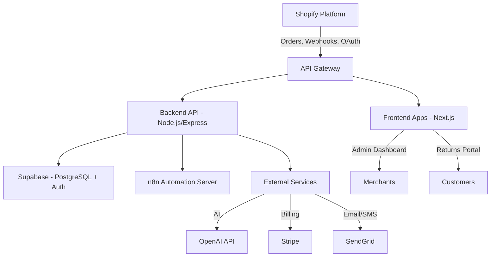

# Returns Automation SaaS

### AI-Powered Returns & Exchanges Automation for Shopify Merchants

The **Returns Automation SaaS** platform provides a complete, secure, and scalable solution to **streamline e-commerce returns**, **reduce refund rates**, and **increase exchanges** using AI-powered decisioning, automation workflows, and real-time analytics.

---

## 🏆 Core Value Proposition

* **For Merchants**: Lower refund leakage, gain actionable insights, automate manual workflows.
* **For Customers**: Branded, self-service portal for seamless returns & exchanges.
* **For the Platform**: Enterprise-ready architecture with built-in scalability, multi-tenant security, and compliance with Shopify, GDPR, and payment standards.

---

## 🏗️ High-Level System Architecture



* **Frontend**: Returns Portal + Merchant/Admin Dashboards
* **Backend**: API Gateway + Node.js services
* **Database**: Supabase (Postgres + Auth + RLS)
* **Automation Layer**: n8n for Shopify webhook orchestration, retention, and notifications
* **External Services**: OpenAI (AI suggestions), Stripe (billing), SendGrid (emails)

📖 Detailed design references: \[Deployment Guide]\[199], \[Backend Guide]\[200], \[Frontend Guide]\[204], \[Database Guide]\[197], \[FRS]\[202].

---

## 🔑 System Modules

### 1. **Frontend Applications**

* **Customer Returns Portal**: Mobile-first, branded, self-service UI with AI suggestions
* **Merchant Admin Dashboard**: Embedded in Shopify Admin; manage returns, monitor AI, handle billing
* **Internal Admin Dashboard**: For system health, support, and compliance

Stack: **Next.js, Tailwind CSS, shadcn/ui, Recharts, Framer Motion**

---

### 2. **Backend API & Gateway**

* Central routing, HMAC validation, JWT auth, and RBAC enforcement
* RESTful, versioned endpoints (`/api/v1/...`)
* Middleware stack for logging, validation, rate-limiting, error handling

Stack: **Node.js + Express, Zod/Joi, Winston, Sentry**

---

### 3. **Database Layer**

* Supabase (PostgreSQL) with **RLS for strict tenant isolation**
* Core tables: `merchants`, `users`, `returns`, `return_items`, `ai_suggestions`, `analytics_events`, `billing`
* Real-time updates via Supabase subscriptions

---

### 4. **Automation & Orchestration (n8n)**

* Shopify webhook ingestion (HMAC validated)
* Retention campaigns (AI-powered win-back flows)
* Notifications (Slack, Email, SMS)
* Scheduled jobs (token refresh, cleanup)

Stack: **n8n (Docker/Railway/Render)**

---

### 5. **AI Integration**

* AI suggestions for exchanges (OpenAI API)
* Confidence scores + merchant override loop
* AI prompts logged for audit & transparency
* Roadmap: LangChain, Pinecone vector DB, anomaly detection

---

### 6. **Billing & Subscription**

* Stripe subscription plans: Starter, Growth, Pro
* 14-day free trial; usage-based limits
* Billing events logged in `billing` + Stripe webhooks

---

## 🔐 Security & Compliance

* **Authentication**: Supabase Auth, JWT-based, short-lived tokens
* **Data Isolation**: RLS on all merchant data tables
* **Webhook Security**: Shopify HMAC signature validation
* **Encryption**: Tokens encrypted at rest (Shopify/Stripe)
* **Compliance**: GDPR, Shopify Partner policies, HTTPS enforced

---

## ⚙️ Developer Guide

### Prerequisites

* Node.js 18+
* Supabase project + keys
* Stripe account (test mode)
* OpenAI API key
* n8n instance (Docker or hosted)

### Local Setup

```bash
git clone https://github.com/mhmalvi/returns-flow-automator.git
cd returns-flow-automator
npm install
```

Add `.env.local`:

```env
VITE_SHOPIFY_CLIENT_ID=2da34c83e89f6645ad1fb2028c7532dd
VITE_APP_URL=https://ras-8.vercel.app
VITE_SUPABASE_URL=https://pvadajelvewdazwmvppk.supabase.co
VITE_SUPABASE_ANON_KEY=your_supabase_anon_key
VITE_DEV_MODE=true
SUPABASE_SERVICE_ROLE_KEY=your_service_role_key
SHOPIFY_CLIENT_SECRET=your_shopify_client_secret
OPENAI_API_KEY=your_openai_api_key
STRIPE_SECRET_KEY=your_stripe_secret_key
JWT_SECRET_KEY=h5-production-jwt-secret-key-change-this-in-production-2024
```

Run:

```bash
npm run dev      # Frontend
npm run api      # Backend
docker-compose up n8n # or start hosted n8n
```

### Shopify App Installation

The app is configured for **custom distribution** and can be installed using:

**Install URL**: `https://ras-8.vercel.app/install?shop={SHOP_NAME}.myshopify.com`

**Test Store**: `https://ras-8.vercel.app/install?shop=test-14fdgsdvvi0.myshopify.com`

### OAuth Flow Status ✅

- ✅ Custom distribution configured via Shopify CLI
- ✅ OAuth flow fully functional for new store installations  
- ✅ App Bridge integration with embedded mode
- ✅ Session management with both App Bridge tokens and OAuth cookies
- ✅ Proper error handling and authentication redirects

---

## 🛠 CI/CD & Deployment

* **Frontend**: Vercel (auto-deploy from GitHub)
* **Backend API**: Railway/Render/DO (stateless, horizontally scalable)
* **Database**: Supabase (auto-scaling, daily backups)
* **Automations**: Dedicated n8n per environment
* **Monitoring**: Sentry + LogRocket

---

## 📈 Roadmap

* [ ] Pinecone vector DB for AI-driven returns clustering
* [ ] WooCommerce + BigCommerce integrations
* [ ] Mobile merchant app
* [ ] Loyalty/retention integrations
* [ ] Multi-language support
* [ ] AI anomaly detection & predictive insights

---

## 👥 Governance & Contribution

* **Coding Standards**: ESLint, Prettier, TypeScript
* **Testing**: Jest (unit + integration)
* **Docs**: Swagger/OpenAPI for APIs
* **Version Control**: GitHub Flow + PR reviews
* **Contributions**: Fork → Branch → PR


